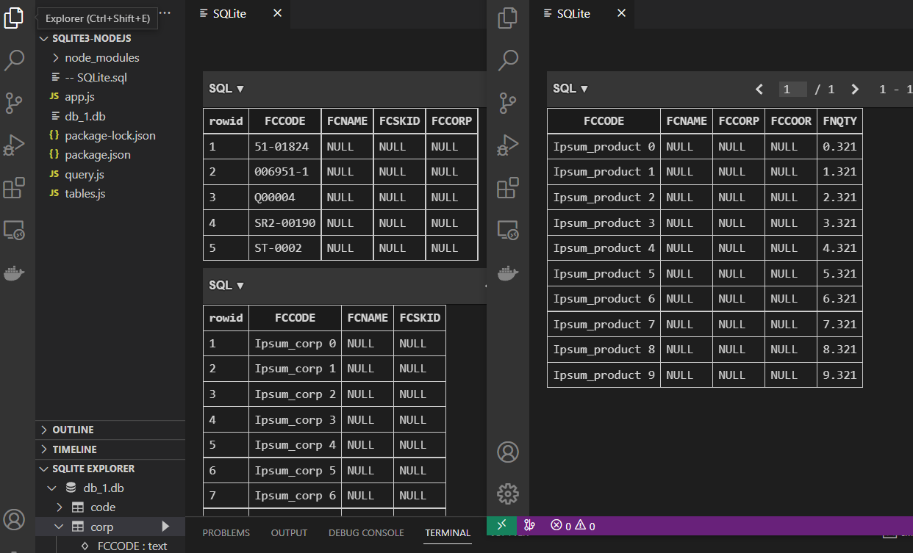

<<<<<<< HEAD
# SQLite3-Nodejs
=======
use node ^16.00
# 1. SETUP
[x] <pre><code>npm install
</code></pre>

[x] <pre><code>npm run dev
</code></pre>

run your sqlite with palette --->  ctrl + shift + p then type sqlite:open database
open the `db_1.db` on the SQLITE EXPLORER you can see the DB in their It's a table

>>>>>>> d88b0fa (Add existing project files prior to the push to GitHub.)
